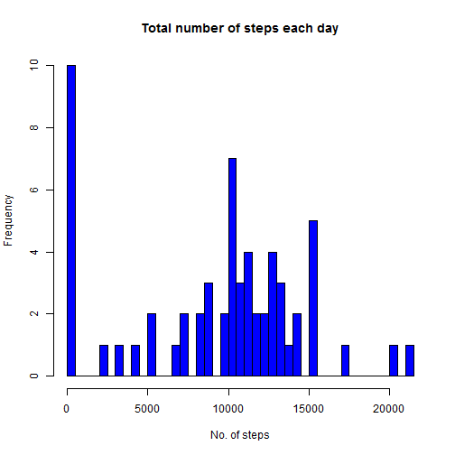
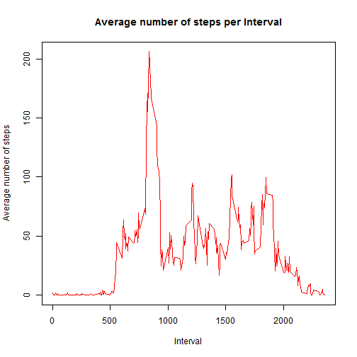
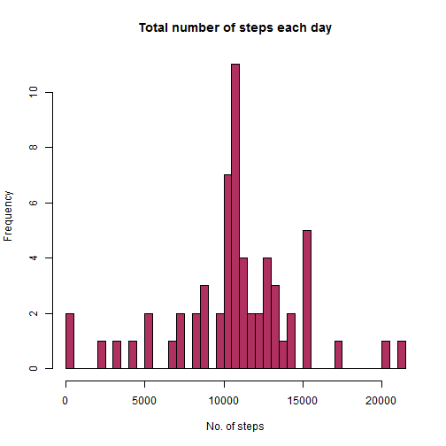
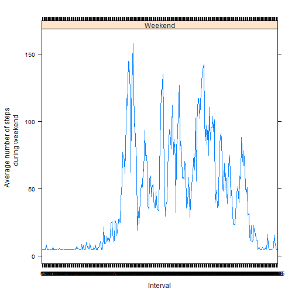
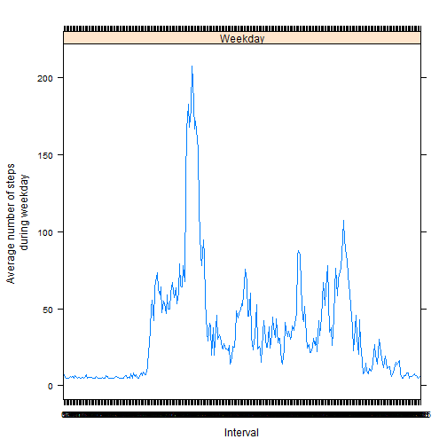

# Reproducible Research: Peer Assessment 1


## Loading and preprocessing the data

First the dataset is read into a data frame variable. Then, a new datset is 
created after coercing the interval variable to a factor

```r
        dataset <- read.csv("activity.csv")
        new.dataset <- transform(dataset, interval = as.factor(interval))
```

## What is mean total number of steps taken per day?

The dataset is split into subsets of data for each date. Thereafter, the number 
of steps per day are calculated by summing the steps over all the intervals for
a given date.


```r
        total.steps <- tapply(new.dataset$steps, new.dataset$date, sum, 
                                              na.rm = TRUE, simplify = TRUE)
```

The following is a histogram of the total number of steps taken each day.

```r
        hist(total.steps, col = "blue", breaks = 50, 
                            main = "Total number of steps each day", 
                            xlab = "No. of steps")
```

 

The mean and median total number of steps taken per day are calculated.

```r
        mean.steps <- mean(total.steps, na.rm = TRUE)
        median.steps <- median(total.steps, na.rm = TRUE)
```

The mean total number of days is **9354.2295** and the median total 
number of days is **10395**.


## What is the average daily activity pattern?

The dataset is split into subsets of data for each interval. Thereafter, the 
average number of steps per interval are calculated by summing the steps over 
all the dates for a given interval.


```r
        average.steps <- tapply(new.dataset$steps, new.dataset$interval, mean, 
                                              na.rm = TRUE, simplify = TRUE)
```

The following is a time series plot of the 5-minute interval (x-axis) and the 
average number of steps taken, averaged across all days (y-axis)

```r
          plot(names(average.steps), as.vector(average.steps), type = "l", 
               col = "red", main = "Average number of steps per Interval", 
                            ylab = "Average number of steps", xlab = "Interval")  
```

 

The maximum number of steps and its corresponding 5 minute interval are 
calculated.

```r
        max.index <- match(max(average.steps, na.rm = TRUE), average.steps) 
        max.name  <- names(average.steps[max.index])
        max.val   <- max(average.steps, na.rm = TRUE)
```

The 5 minute interval starting from **835** has the maximum number of 
steps equal to **206.1698**.


## Imputing missing values

There are a number of records with missing values. They are coded as 'NA'.
The follwoing code calculates the number of records with missing values.


```r
        na.vector <- complete.cases(new.dataset)
        na.count  <- sum(!na.vector)
```

The total number of missing values (no of rows with 'NA') is **2304**

### Strategy adopted for filling in all the missing values

The missing values are filled with the mean number of steps taken across 
all days across all intervals. The original dataset is modified with its missing
values filled by the mean number of steps


```r
        avg.data <- as.data.frame(average.steps)
        new.dataset$steps[!na.vector] <- mean(new.dataset$steps, na.rm = TRUE)
```

The modified dataset with imputed missing values is split into subsets of data 
for each date. Thereafter, the number of steps per day are calculated by summing
the steps over all the intervals for a given date.


```r
        sum.steps <- tapply(new.dataset$steps, new.dataset$date, sum, 
                                              na.rm = TRUE, simplify = TRUE)
```
.
The following is a histogram of the total number of steps taken each day for
the modified dataset with imputed missing values

```r
        hist(sum.steps, col = "maroon", breaks = 50, 
                            main = "Total number of steps each day", 
                            xlab = "No. of steps")
```

 

The mean and median total number of steps taken per day are calculated for the
modified dataset with imputed missing values.

```r
        impmean.steps <- mean(total.steps, na.rm = TRUE)
        impmedian.steps <- median(total.steps, na.rm = TRUE)
```

For the modified dataset with imputed missing values, the mean total number of 
days is **9354.2295** and the median total 
number of days is **10395**.

With the strategy adopted for imputing missing values, the mean and median for
the modified dataset remain unchanged.

The distribution of the total daily number of steps has become less skewed 
and more normalized with most values populating around the mean with the 
imputed dataset.


## Are there differences in activity patterns between weekdays and weekends?

A revised dataset is created after coercing "date" to a Date variable.A new 
variable indicating either weekday or weekend is added to the revised dataset


```r
        revised.dataset <- transform(new.dataset, 
                                     date = as.Date(date, "%Y-%m-%d"))
        revised.dataset$day <- weekdays(revised.dataset$date, abbreviate = TRUE)
        revised.dataset$ind <- sapply(revised.dataset$day, function(d) {
                if(d == "Sat"| d == "Sun") {"Weekend"} else {"Weekday"}})
        revised.dataset$ind <- as.factor(revised.dataset$ind)
```

The following is a time series plot of the 5-minute interval (x-axis) and the 
average number of steps taken (y-axis), averaged across all weekdays and
weekends.


```r
library(lattice)
avg.steps <- tapply(revised.dataset$steps, revised.dataset$interval, mean, 
                                              na.rm = TRUE, simplify = TRUE)
xyplot(tapply(steps, interval, mean, na.rm = TRUE, simplify = TRUE) ~  
               interval | ind, data = revised.dataset[revised.dataset$ind == "Weekend", ], layout = c(1, 1), type = "l", ylab = "Average number of steps 
       during weekend", xlab = "Interval")
```

 

```r
xyplot(tapply(steps, interval, mean, na.rm = TRUE, simplify = TRUE) ~  
               interval | ind, data = revised.dataset[revised.dataset$ind == "Weekday", ], layout = c(1, 1), type = "l", ylab = "Average number of steps 
       during weekday", xlab = "Interval")
```

 
